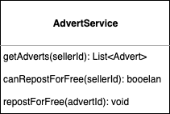
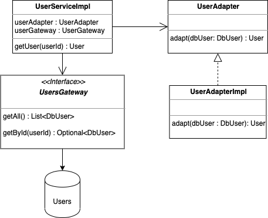
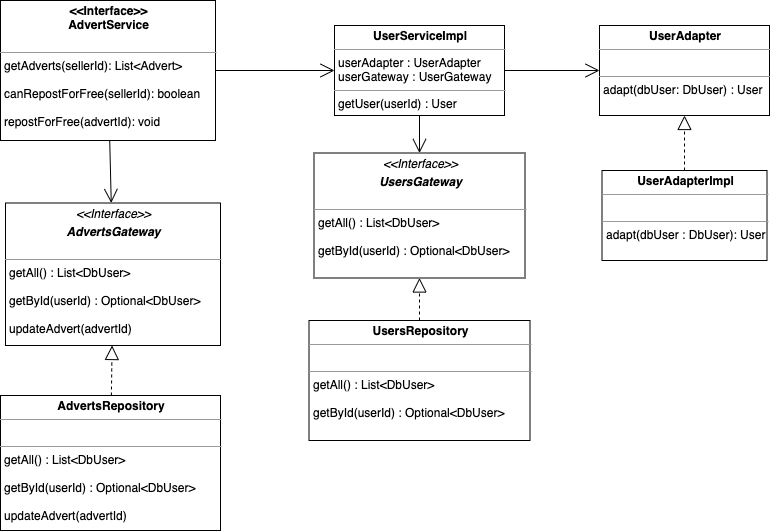

###### General warnings
- Please take your time to read the exercise. 
- Please commit the result of the exercises (1,2 and 3) in different commits. We would like to see the evolution of your 
thinking process. 
    

###### Example 1
You are asked here to only write Acceptance Criteria based on the interface of AdvertService.

This service contains 3 different methods/endpoints. Please write tests in sudo code (no need to be too precise, as you 
will not be executing any piece of code for this part. We are more interested in your critical thinking process.

Please find below a UML representation of this class.  

###### Example 2
You are asked here to write unit tests for the following classes:
- UserService
- UserAdapter

We here particularly interested in your approach regarding mocks/stubs. Remember what should be the best practices when 
third parties are involved. Please also show us your preferences regarding the classicist/mockist approaches.

JUnit is provided, but please feel free to use any other technology you like (Spock, TestNG, Scalatest...). You will not
be judged on the technology you use, but on your ability to use it properly relatively to your thinking process and 
methodology.

If you have any specific information you need to tell us regarding this part of the exercise, please add it in a README.md. 

###### Example 3
You are asked here to write an integration test on the AdvertService, integrating all provided classes. You are also 
provided 2 in memory gateways (AdvertsRepository and UsersRepository)  

This integration test should contain at least all scenarios you thought of for the first example.

Please find below the UML diagram for all these classes

